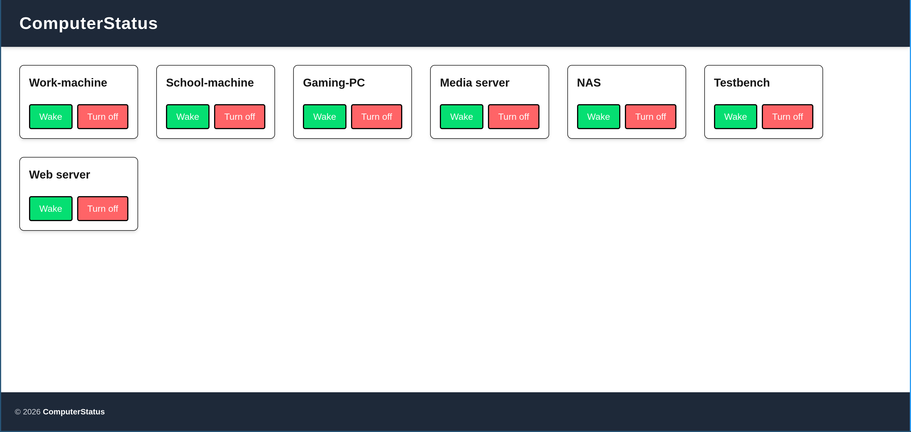
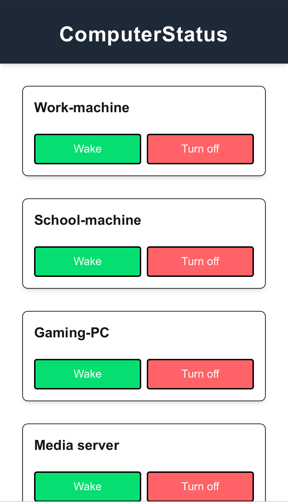

# Remote Start & Shutdown Project (NEXT.js)

This is a small **NEXT.js** project for remotely starting and shutting down Linux and Windows machines.  
It uses **Wake-on-LAN (WoL)** and **SSH** for control.

## Pictures
Here are pictures of the UI. It is responsive and scale according to device size.


---

## Getting Started

1. **Clone the repository** and edit the `config.json` file to match your computers. Fill in according to the fields described under **Config**.

2. **Generate an SSH key pair** on the machine that will run this service. Configure the other computers to allow SSH connections using the generated public key. Make sure that an SSH server is started automatically on startup.

3. **Edit the `.env` file** in the root directory. Insert the generated private key and edit the port if using Docker.

4. **Start the Node.js server**:

```bash
npm run build
npm start
```

Notice that this won't use the specified port in the .env file.

5. **Open the UI** using your web browser. The service is availbile at `http://localhost:3000` if you don't change the port. Enjoy!

## Docker

It is recommended to use docker for running the project. Before using, follow all previous steps, but instead of running it via npm, run

```bash
docker compose build
docker compose run -d
```

This will start Docker and run the service using the credentials in `.env`.

## Config
All config is happening inside config.json. Each entry is it's own machine. Here are descriptions for the fields:

| Name | Description |
|-----------------|----------------|
| id | A unique number for each machine. |
| name | The name which will be associated with the computer in the UI. |
| mac | The MAC-address of the target computer. |
| ip | The IP-address of the target computer. |
| linux | If the machine is running Linux. If set to false, the project assumes that Windows is used. |
| username | The username which will be used by SSH to access the system. |
